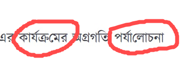

# Kalpurush Font Modification for pdfMake

A modified version of the Kalpurush font optimized for use with the pdfMake JavaScript library.

## Problem Statement

The original Kalpurush font had issues when used with pdfMake:

1. Bangla characters with 'kar' signs (ে, ো, etc.) were broken and displayed incorrectly in the middle of words.
2. The library couldn't generate bold text properly by default.

Example of the issue:

## Solution

This repository contains:
1. A modified version of Kalpurush font that correctly renders Bangla characters with 'kar' signs
2. A custom bold version of the font for proper bold text rendering

## Usage

1. Replace the original Kalpurush font with these modified versions in your pdfMake project
2. For bold text, use the Kalpurush-Bold font explicitly

## Font Files
- `Kalpurush-mod.ttf` - Regular font with fixed 'kar' signs
- `Kalpurush-mod-Bold.ttf` - Bold version of the font
